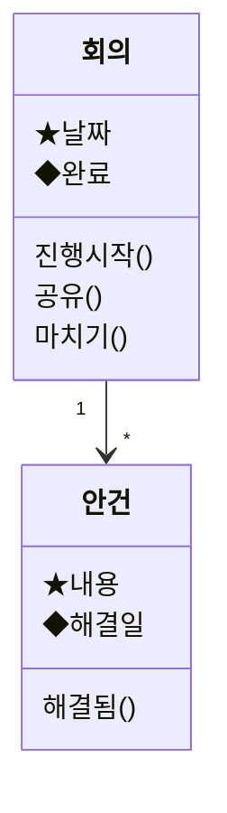

# Step 1. 모델: 객체 추출

모델은 설계 품질의 대부분을 결정한다. 이 단계가 흔들리면 뒤 단계의 레이아웃을 아무리 다듬어도 구조가 무너진다.

## 입력
태스크 문장 목록 ("[누가] [무엇을] [어떻게] 한다"). 다른 형태의 입력은 SKILL.md Step 0에서 태스크로 바꾼 뒤 이 단계로 온다.

## 절차

### 1. 품사 표시
각 태스크 문장에서 명사와 동사를 표시한다.

```
[안건]과 [결정사항]을 (적는다)
이번 달 [결정사항]을 (확인한다)
```

### 2. 명사 정리
- **동의어 통합:** 같은 것을 가리키는 다른 말은 하나로 합친다. 사용자가 가장 자주 쓰는 말을 대표 이름으로 고른다.
- **인스턴스 → 클래스:** 구체적인 개체는 종류로 올린다. "민수", "엄마" → "사람"
- **입도 맞추기:** "기록"처럼 여러 객체를 감싸는 우산 단어는 쪼갠다. 너무 작은 것은 속성으로 내린다.
- **명사화된 동사 주의:** "해결", "공유", "수신", "승인"은 객체일 수도, 속성일 수도, 액션일 수도 있다. 다음 판정 테스트로 가린다.
- **동사도 뒤집어 본다:** 명사만 보지 말고 동사(액션 후보)도 모두 아래 "액션의 객체화" 절차(AO1~AO6)에 통과시킨다. 액션 이름 안에 객체가 숨어 있는 경우가 많다. 여기서 나온 후보도 다음 판정 테스트를 똑같이 거친다.

### 3. 객체 판정 테스트
| 테스트 | 질문 |
|---|---|
| (a) 셀 수 있다 | "~가 3개 있다"라고 자연스럽게 말할 수 있는가 |
| (b) 여러 인스턴스 | 같은 속성을 가진 인스턴스가 여러 개 존재하는가 |
| (c) 공통 액션 | 인스턴스들에 공통으로 할 수 있는 액션이 있는가 |

- 세 가지 모두 통과 → **객체**
- (a)는 통과하지만 인스턴스가 앱에 하나뿐 → **싱글톤 객체** (내 계정, 앱 설정)
- 통과하지 못함 → **속성**(값이나 상태) 또는 **액션**(동사)

판정 예:
- "플래그" → 메일의 속성(플래그 여부) + 메일의 액션(플래그 달기). 객체 아님.
- "해결" → 안건의 상태 속성(해결일) + 결정사항과의 관계. 객체 아님.
- "태그" → 셀 수 있고, 이름이라는 공통 속성이 있고, 이름 변경·삭제가 가능하다. 객체.

### 4. 속성 정의
- 사용자가 보고, 식별하고, 판단하는 데 쓰는 속성만 적는다. 내부 ID, 타임스탬프 같은 구현 속성은 사용자에게 의미가 있을 때만 넣는다.
- 컬렉션에서 항목을 식별하는 데 쓸 **핵심 속성 1~3개**에 ★를 붙인다. 이것이 컬렉션 형식 선택(Step 3)의 근거가 된다.
- 상태 속성(완료, 해결됨)은 따로 표시한다. P3(객체가 자기 상태를 드러냄)의 재료가 된다.

### 5. 관계와 다중도
- 표기: `A 1 ─ * B` (A 하나에 B 여러 개), `A * ─ * B` (다대다)
- **소유 관계**(A가 사라지면 B도 의미가 없다)인지 **참조 관계**(B는 독립적으로 존재한다)인지 구분한다. 소유 관계는 삭제 규칙을 적어야 한다.
- 관계는 Step 2에서 네비게이션이 되므로 빠뜨리지 않는다.

### 6. 액션 할당
동사를 객체에 붙인다.

| 종류 | 위치 | 예 |
|---|---|---|
| 컬렉션 액션 | 컬렉션 뷰 | 추가(생성), 정렬, 필터, 다중 선택 |
| 싱글 액션 | 싱글 뷰 | 편집, 삭제, 복제, 공유, 도메인 액션(해결 처리, 완료, 승인) |
| 관계 액션 | 양쪽 싱글 중 하나 이상 | 연결, 해제 (태그 붙이기, 담당자 지정) |

- 동사가 두 객체에 걸쳐 있으면, 결과가 생기는 쪽이 아니라 **사용자가 그 순간 보고 있는 쪽**에 둔다. 필요하면 반대쪽에도 진입점을 둔다.
  - 예: "안건이 해결되어 결정사항을 적는다" → 액션은 안건 싱글의 "해결됨". 결과로 결정사항이 생긴다.
- "생성"은 싱글이 아니라 컬렉션(또는 부모 싱글 안의 자식 컬렉션)의 액션이다.

### 7. 제안 항목
요구사항에는 없지만 필요한 것(기본 CRUD, 정렬, 생성일, 빈 상태 처리)을 추가하고 `(제안)`으로 표시한다.

### 8. 객체의 역할 구분
| 역할 | 정의 | 뷰에 미치는 영향 |
|---|---|---|
| 메인 객체 | 사용자가 독립적으로 찾고 다루는 대상 | 루트 네비게이션 후보. 컬렉션 + 싱글 |
| 서브 객체 | 다른 객체를 통해서만 접근한다 | 부모 싱글 안의 컬렉션 + 자기 싱글 |
| 단서 객체 | 다른 객체를 찾기 위한 분류·그릇 역할만 한다 (폴더, 카테고리, 메일함) | 싱글을 생략하거나(O2) 자식 컬렉션과 통합한다(C1) |
| 싱글톤 | 앱에 하나뿐이다 (계정, 설정) | 싱글만 (O1) |

### 9. 스코프
사용자가 인식하거나 인식해야 하는 개념만 모델에 넣는다. 조인 테이블, 내부 로그, 토큰, 캐시는 넣지 않는다. 스코프가 넓으면 한 앱에서 많은 일을 할 수 있지만 UI가 복잡해지고, 좁으면 쓸모가 줄어든다. 애매하면 사용자에게 확인한다.

## 액션의 객체화

명사를 뽑는 것만으로는 부족하다. 실제 프로젝트에서는 객체가 **액션 이름 뒤에 숨어** 있는 경우가 많다. 이미 "객체 선택 → 액션 선택" 순서로 되어 있는 화면이라도, 액션을 다시 읽어보면 더 객체 지향적으로 만들 여지가 보인다. 모든 액션 후보에 다음 절차를 적용한다.

**AO 절차는 객체 후보를 찾는 단계이고, 채택 여부는 항상 판정 테스트(절차 3)가 결정한다.** AO로 꺼낸 후보는 명사에서 뽑은 후보와 똑같이 테스트를 거친다. 예외는 AO5뿐이다. AO5는 객체를 만드는 것이 아니라 결과를 기존 객체의 속성으로 옮기는 것이므로 테스트 대상이 아니다.

### AO1. 액션 이름을 "[객체]의 [X]를 [동사]"로 풀어 쓴다
X가 드러나면 그것이 속성인지 객체인지 판정 테스트로 가린다.

| 원래 액션 | 풀어 쓴 형태 | 드러난 것 |
|---|---|---|
| 기기 > 별칭 변경 | 기기의 **별칭**을 변경한다 | 별칭 = 기기의 속성 → 제자리 편집 |
| 기기 > 인증서 설정 | 기기의 **인증서**를 설정한다 | 인증서 = 객체 |
| 기기 > 인증서 내보내기 | 기기의 **인증서**를 내보낸다 | 인증서 = 객체, 내보내기 = 인증서의 액션 |

꺼낸 객체는 원래 객체의 싱글 안 컬렉션이 되고(N2), 원래 액션은 꺼낸 객체의 액션이 된다. 두 객체의 다중도도 이때 정리한다. (사례: `cases.md` CASE-01)

### AO2. 추상적인 액션 이름은 한 번 더 변환한다
액션 이름이 목적어를 드러내지 않고 추상적이거나 업무 목적에서 따온 이름이면, 실제로 무엇에 대한 어떤 조작인지로 바꾼 뒤 AO1을 적용한다.
- "권한 관리" → 인증서 내보내기
- "권한 인계" → 인증서 내보내기 (인계하려고 내보내는 것이므로)

메뉴에서는 서로 달라 보여도 실질적으로 같은 객체에 대한 같은 조작일 수 있다. (사례: CASE-01)

### AO3. 액션 뒤에 숨은 객체를 보이게 만든다
어떤 객체가 특정 액션을 실행해야만 보인다면, 그 객체는 숨어 있는 것이다. 사용자는 **그냥 그 객체를 확인하고 싶을 때** 어디로 가야 할지 알 수 없다. (사례: CASE-01)

- **감지 신호:** "지금 X 상태는 어디서 확인해요?"라는 질문에 "X 출력(내보내기, 다운로드, 리포트)에서 볼 수 있어요"라는 답이 나온다.
- **처리:** 객체로 꺼내서 컬렉션으로 항상 보이게 하고, 원래 액션(내보내기)은 그 객체의 액션으로 옮긴다. 객체가 화면 안쪽 깊은 곳에서 앞으로 나오면서 사용자와의 거리가 가까워진다.

### AO4. 달라 보이는 객체를 일반화할 수 있는지 확인한다
액션에서 꺼낸 객체들이 이름은 달라도 같은 속성과 액션을 가지면 하나의 객체로 합친다.

### AO5. 동사의 명사화: 액션 대신 결과를 속성으로 보여준다
사용자가 "계산", "확인", "조회", "생성" 같은 액션을 실행해서 결과를 얻는 구조라면, 가능한 한 **결과를 객체의 속성으로 미리 만들어 항상 보여준다.**
- "합계 계산" 버튼 대신 합계를 속성으로 항상 표시한다
- "상태 확인" 버튼 대신 상태(◆)를 객체 표현에 드러낸다 (P3)
- "요약 만들기"를 매번 실행하는 액션이 아니라, 회의의 요약 속성으로 존재하게 한다

설계 중에는 계속 "이 동작을 명사로 보면 어떻게 되는가?"라고 물어본다. 새로운 구조 아이디어가 여기서 나오는 경우가 많다.

### AO6. 행위 자체가 기록으로 남으면 객체 후보로 올린다
행위의 결과가 독립적인 기록이 되어 **자기만의 속성, 상태, 이력을 갖고, 다른 사람이나 나중의 내가 다시 다루는** 경우, 그 행위를 명사형으로 바꿔 객체 후보로 올린다. 채택되면 원래의 동사들은 그 객체의 액션이나 상태가 된다.

| 행위(동사) | 객체 후보 | 그 객체의 액션·상태 |
|---|---|---|
| 신청하다 | 신청 | 제출, 승인, 반려, ◆처리 상태 |
| 예약하다 | 예약 | 변경, 취소, ◆확정 여부 |
| 주문하다 | 주문 | 결제, 취소, ◆배송 상태 |
| 송금하다 | 거래 | 영수증 보기, ◆완료 여부 |

**판정은 판정 테스트로 한다.** 행위에 적용할 때는 각 테스트를 다음 질문으로 바꿔 물으면 쉽다.

| 테스트 | 행위에 적용한 질문 | "신청"의 경우 |
|---|---|---|
| (a) 셀 수 있다 | 행위가 끝난 뒤 "~ 3건"이라고 셀 수 있는 기록이 남는가 | 신청 3건 ✅ |
| (b) 여러 인스턴스 | 그 기록들을 목록으로 다시 찾아볼 필요가 있는가 | 내 신청 목록, 승인 대기 목록 ✅ |
| (c) 공통 액션 | 기록마다 상태를 추적하거나 공통으로 할 조작이 있는가 | 처리 상태, 승인·반려 ✅ |

통과하지 못하면 객체로 만들지 않고 액션으로 둔다. (사례: CASE-02)
- "공유": 기록이 남지 않으면 (a)에서 탈락 → 액션
- "해결": 안건마다 한 번뿐이고 자기만의 속성·액션이 없으면 (b)(c)에서 탈락 → 안건의 상태 속성

## 암묵적 객체 찾기 (기존 UI가 태스크 지향일 때)

- **입출력 정보 나열:** 절차의 입력값과 출력값을 모두 적고, 공통 개념으로 묶어서 일반화한다.
  - 실행 버튼은 대개 두 객체 사이의 동기화로 대체된다. (사례: CASE-08)
- **반복되는 목록:** 여러 태스크 화면에 같은 목록이 반복되면, 그 목록의 항목이 객체다. (사례: CASE-10)
- **메뉴의 목적어:** "~관리", "~조회", "~등록" 메뉴의 목적어가 객체다.

## UI 모델과 DB 모델

- 둘은 비슷하지만 목적이 다르다. UI 모델은 사용자에게 보이는 객체만 담고, DB 모델은 정규화와 조인까지 포함한다. UI 모델은 ER 다이어그램보다 API 응답 형태나 컴포넌트 props 설계에 더 가깝다.
- 거꾸로 말하면 UI 모델을 잘 만들면 API와 데이터 모델이 단순해진다. 구현 연결은 `implementation-mapping.md`를 본다.

## 산출 형식

**객체 표**

| 객체 | 역할 | 속성 (★ 핵심, ◆ 상태) | 관계 | 컬렉션 액션 | 싱글 액션 |
|---|---|---|---|---|---|
| 안건 | 메인 | ★내용, ★작성일, ◆해결일 | 회의 1 ─ * 안건, 안건 1 ─ 0..1 결정사항 | 추가, 필터(미해결/해결됨) | 편집, 삭제, 해결됨 |

**Mermaid 클래스 다이어그램** (식별자는 영문, 표시는 라벨로)


