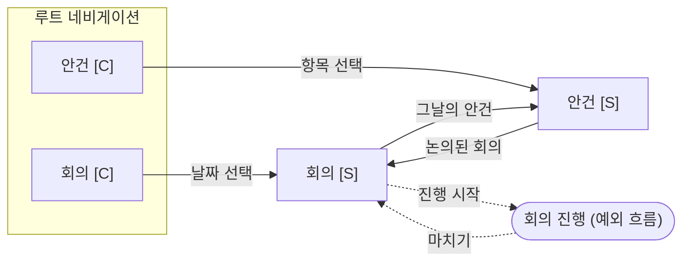

# Step 2. 인터랙션: 뷰와 네비게이션

## 목차
- 뷰
- 뷰 도출 절차
- 뷰의 생략 (O1~O5)
- 뷰의 결합 (C1~C6)
- 싱글 여러 개 (M1~M2)
- 기타 뷰 규칙 (V1~V3)
- 관계 → 네비게이션 (N1~N6)
- 루트 네비게이션 (R1~R8)
- 예외 흐름의 모델링
- 다이어그램 표기
- 이 단계의 산출물

인터랙션 레이어는 모델과 프레젠테이션을 잇는 메커니즘이다. 여기서 뷰와 뷰 사이의 관계를 정하고 다이어그램으로 그린다. 구체적인 화면 배치는 Step 3에서 정하지만, 생략·결합처럼 어떤 뷰를 함께 보여줄지는 여기서 정한다.

## 뷰

**뷰**는 사용자가 화면에서 보는 정보 표시 단위다. 한 화면, 분할 레이아웃의 한 페인, 시트, 메뉴로 펼쳐진 목록 하나가 모두 뷰다. 객체는 뷰를 통해서만 사용자에게 지각되고, 하나의 객체는 보통 여러 뷰에 나타난다.

| | 컬렉션 (Collection) | 싱글 (Single) |
|---|---|---|
| 내용 | 같은 종류의 객체 여러 개 | 객체 하나 |
| 보이는 속성 | 핵심 속성(★), 중요한 관련 객체 | 전체 속성 + 관련 객체 |
| 사용자의 행동 | 훑어본다 | 다가가서 자세히 본다 |
| 붙는 액션 | 생성, 정렬, 필터, 다중 선택 + 항목 액션 | 편집, 삭제, 도메인 액션 |
| 흔한 이름 | 목록 화면 | 상세 화면 |

사람은 주변을 훑어보다가 관심 가는 것에 다가가서 자세히 보는 일을 반복한다. 컬렉션과 싱글은 이 두 행동에 대응한다.

## 뷰 도출 절차

1. **기계적으로 시작한다 (V1).** 모든 메인 객체에 컬렉션과 싱글을 하나씩 두고, 컬렉션 → 싱글을 화살표로 잇는다.
2. **관계로 호출 관계를 잇는다 (N1~N4).** 다중도를 단서로, 어떤 뷰에서 어떤 뷰를 불러오는지 화살표를 추가한다.
3. **각 뷰의 존재 의의를 묻는다.** "이 뷰가 없으면 사용자가 무엇을 못 하게 되는가?" 답이 없거나 다른 뷰가 이미 그 역할을 하면 생략 후보다 (O1~O5).
4. **함께 봐야 하는 뷰를 묶는다.** 사용자가 두 뷰를 오가며 일한다면 결합 후보다 (C1~C6).
5. **싱글의 역할이 둘 이상이면 나눈다 (M1~M2).**
6. **결정마다 근거를 적는다.** 생략·결합의 목적은 화면 수를 줄이는 것 자체가 아니라, 사용자가 보는 단위를 관심 대상에 맞추는 것이다.

## 뷰의 생략

| ID | 조건 | 생략하는 뷰 | 처리 | 예 |
|---|---|---|---|---|
| O1 | 싱글톤: 앱에 하나뿐 | 컬렉션 | 싱글만. 다른 컬렉션 위의 버튼이나 프로필 영역에서 연다 | 계정, 사이트 설정 (CASE-05) |
| O2 | 단서 객체: 다른 객체를 찾기 위한 그릇일 뿐 | 싱글 | 싱글은 표에 내지 않고 설정 화면으로 격하하거나, C1로 자식 컬렉션과 합친다 | 메일함, 폴더, 카테고리 (CASE-09) |
| O3 | 컬렉션으로 충분: 속성이 1~2개이거나, 인스턴스가 부모당 몇 개뿐이라 부모 싱글 안에서 전부 보여줄 수 있다 | 싱글 | 컬렉션 항목에서 제자리 편집하거나 인라인 펼침으로 보여준다 | 태그, 숙소의 온천 (CASE-07) |
| O4 | 다른 뷰가 역할을 흡수: 옆에 놓인 다른 객체의 뷰가 그 싱글의 정보를 이미 보여준다 | 싱글 | 흡수한 뷰로 대체한다 | 상품 목록 옆의 코디네이트 싱글이 상품 싱글을 대신한다 (CASE-03) |
| O5 | 작업 대상 객체: 사용자가 지금 조립하고 있는 것 하나만 다룬다 | 컬렉션 | 싱글만. 나중에 여러 개를 저장할 필요가 생기면 컬렉션을 추가한다 | 조립 중인 코디네이트, 작성 중인 장바구니 (CASE-03) |

- O3로 싱글을 생략하면, 컬렉션 항목 탭을 싱글 열기가 아닌 다른 액션(선택, 펼침)에 쓸 수 있다.
- O5처럼 행위를 객체로 만들면 "여러 개"라는 이전에는 보이지 않던 가능성이 드러나기도 한다. 이는 컬렉션을 추가할지 판단하는 근거가 된다.

## 뷰의 결합

| ID | 패턴 | 언제 | 구성 |
|---|---|---|---|
| C1 | 부모 싱글 + 자식 컬렉션 일체화 ("컬렉션 메인") | 부모가 자식을 찾는 단서 역할이 크고 자기 속성은 적다 | 부모 속성은 헤더에 요약하고, 본문은 자식 컬렉션이다 (N2의 강한 형태) |
| C2 | 싱글 + 관련 컬렉션 요약 ("싱글 메인") | 부모의 자기 속성이 중요하다 | 본문은 부모 속성이고, 관련 컬렉션은 일부만 보여준 뒤 "모두 보기"로 전체 컬렉션 뷰에 연결한다 |
| C3 | 같은 객체의 컬렉션 + 싱글 병치 (마스터-디테일) | 항목을 차례로 훑으며 비교·확인한다 | 왼쪽에서 고르면 오른쪽에 싱글. 좁은 화면에서는 같은 순서의 화면 전환이 된다 |
| C4 | 다른 객체의 컬렉션 + 싱글 병치 | 한 객체의 항목들로 다른 객체를 조립한다 | 왼쪽 컬렉션 항목의 액션(추가, 시착)이 오른쪽 싱글을 바꾼다. 장바구니, 코디네이트, 재생목록 |
| C5 | 관련 객체를 속성으로 표시 | 관련 객체가 식별이나 판단에 중요하다 | 컬렉션 항목과 싱글에 관련 객체 이름을 속성처럼 보이고, 싱글에서는 참조 링크를 둔다 |
| C6 | 두 객체의 컬렉션을 모드리스하게 오가기 | 태스크 선택(사기/팔기, 받은/보낸)으로 나뉘어 있던 화면 | 태스크를 고르는 대신 두 객체(상품, 소지품)의 컬렉션을 전환하거나 나란히 두고, 각 객체에 액션(사기, 팔기)을 붙인다. 태스크 선택이 사라진다 |

- 사례: C1은 CASE-01·CASE-06, C3는 CASE-04, C4·C6은 CASE-03.
- C1과 C2 중 무엇을 쓸지는 "사용자가 부모를 열었을 때 주로 보려는 것이 부모 자신인가, 자식들인가"로 정한다.
- C4와 C6은 사용자가 머릿속에 두 객체를 동시에 떠올리며 일하는 경우다. 머릿속에 있는 객체를 화면에서 다루게 하는 것이 GUI의 특징이므로, 한쪽을 보려고 다른 쪽을 떠나야 한다면 결합을 검토한다.

## 싱글 여러 개

| ID | 패턴 | 언제 | 구성 |
|---|---|---|---|
| M1 | 참조용 / 편집용 싱글 분리 | 내용을 보기만 하는 경우가 많고, 편집은 드물거나 신청·승인 같은 확정 절차를 거친다 | 사용자의 편집 의사로 전환한다. 편집용 싱글은 생성 화면으로도 재사용한다 |
| M2 | 면 분할 싱글 | 속성이 매우 많거나 성격이 다른 두 묶음(설정 / 내용)이 있다 | 탭이나 세그먼트로 나누되 하나의 싱글로 취급한다 |

- M1의 권한별 차이(승인자에게만 코멘트 란 표시 등)는 별도 뷰를 만들지 않고 같은 싱글의 조건부 표시로 처리한다.
- 사례: M1은 CASE-04, M2는 CASE-05.

## 기타 뷰 규칙

| ID | 조건 | 규칙 |
|---|---|---|
| V1 | 메인 객체 | 컬렉션 + 싱글을 기본으로 둔다 (도출 절차 1) |
| V2 | 한 객체에 여러 표현이 필요함 | 같은 컬렉션의 형식 전환(리스트 ↔ 캘린더)으로 처리한다. 별도 화면 계층을 만들지 않는다 |
| V3 | 검색·필터 결과 | 새 뷰가 아니라 같은 컬렉션의 상태다 |

## 관계 → 네비게이션 규칙

| ID | 관계 | 네비게이션 |
|---|---|---|
| N1 | 컬렉션 → 싱글 | 항목 선택으로 싱글을 연다 |
| N2 | A 1 ─ * B | A 싱글 안에 B 컬렉션을 둔다 (C1 또는 C2). B 싱글에서 A 싱글로 가는 링크를 둔다 |
| N3 | A * ─ * B | 양쪽 싱글에 상대 객체의 컬렉션을 둔다 |
| N4 | A 1 ─ 0..1 B | A 싱글에 B 요약과 링크를 두고, B가 없으면 그 자리에 B 생성 액션을 둔다 |
| N5 | 생성 후 | 파라미터 생성이면 새 객체의 싱글로 이동한다. 블랭크 생성이면 컬렉션에서 제자리에 둔다 |
| N6 | 연속 작업 | 같은 액션을 반복할 가능성이 높으면(연속 구매, 연속 추가) 액션 후 컬렉션에 머물고, 결과는 모드리스 메시지로 알린다 |

- 네비게이션 라벨은 목적지 객체(컬렉션)의 이름이다. "더보기", "관리", "바로가기" 같은 모호한 라벨을 쓰지 않는다.
- 네비게이션은 "지금 보는 객체와 직접 관련된 다른 객체를 불러오는 것"으로 생각한다. 그러면 라벨은 자연스럽게 명사가 된다.

## 루트 네비게이션

| ID | 규칙 |
|---|---|
| R1 | 루트 = 메인 객체의 컬렉션들. 루트에는 객체 외의 것을 두지 않는다 |
| R2 | 모바일은 3~5개. 넘치면 사용 빈도가 낮은 객체를 다른 객체의 싱글 안으로 옮기거나 프로필 영역으로 보낸다 |
| R3 | 사용자가 앱을 쓸 때 가장 먼저 떠올리는 객체, 생각의 출발점이 되는 객체를 고른다. 첫 번째 항목이 앱 실행 시 보이는 객체다 |
| R4 | 계정, 설정, 도움말은 루트 밖(프로필 아이콘, 설정 화면)에 둔다 |
| R5 | "홈"이 꼭 필요하면 홈도 객체의 컬렉션이어야 한다 (오늘 항목, 최근 항목, 고정 항목). 기능 버튼 모음은 금지 |
| R6 | 라벨은 명사. "기록하기"가 아니라 "기록" |
| R7 | 객체 이름 뒤에 관리, 목록, 조회, 확인, 등록, 정보, 편집, 소개 같은 말을 붙이지 않는다. "고객 관리"가 아니라 "고객" |
| R8 | 객체 이름 하나를 루트 라벨, 컬렉션 제목, 싱글에서 컬렉션으로 돌아가는 컨트롤 라벨에 똑같이 쓴다. 아이콘은 관련 객체끼리 같은 모티프를 공유해 관계를 암시할 수 있다 |

## 예외 흐름(태스크 흐름)의 모델링

`principles.md`의 허용 조건(T1~T3)을 충족할 때만 쓴다.

- 흐름을 "객체 X의 싱글에서 시작되는 모드" 또는 "객체 X의 생성 과정"으로 표현한다.
- 흐름의 각 단계가 어떤 객체를 생성하거나 편집하는지 적는다.
- 흐름의 끝은 X의 싱글이다.
- 다이어그램에서는 점선으로 일반 네비게이션과 구분한다.

## 다이어그램 표기 (Mermaid)

- 노드 ID는 영문, 라벨은 `객체명 [C]`(컬렉션) / `객체명 [S]`(싱글)
- 결합한 뷰는 `subgraph`로 묶고 제목에 결합 ID를 적는다 (예: `subgraph C1["기기 [S] + 인증서 [C] (C1)"]`)
- 생략한 뷰는 그리지 않고, 뷰 목록 표에 생략 ID를 적는다
- 실선 화살표 = 네비게이션, 엣지 라벨 = 트리거
- 점선 화살표 = 예외 흐름
- 루트 네비게이션 항목은 `subgraph Root`로 묶는다

## 이 단계의 산출물
1. 뷰 목록 표 (뷰 | 종류 | 표시 속성 | 액션 | 진입 경로 | 생략·결합 ID)
2. 생략·결합 결정과 근거 (O·C·M ID별 한 줄)
3. 루트 네비게이션 항목과 순서, 그 근거
4. 네비게이션 다이어그램
5. 예외 흐름이 있으면 허용 조건 ID와 입구·출구
